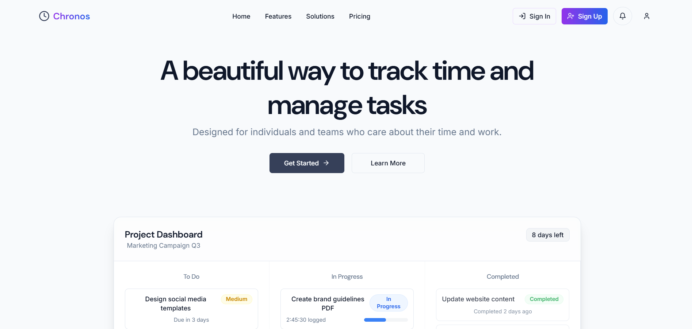
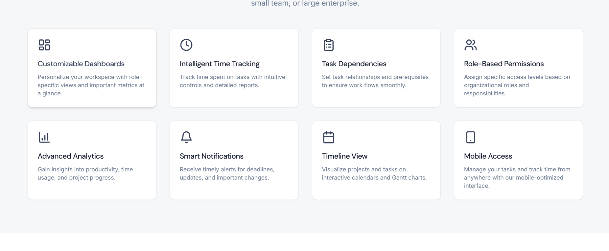
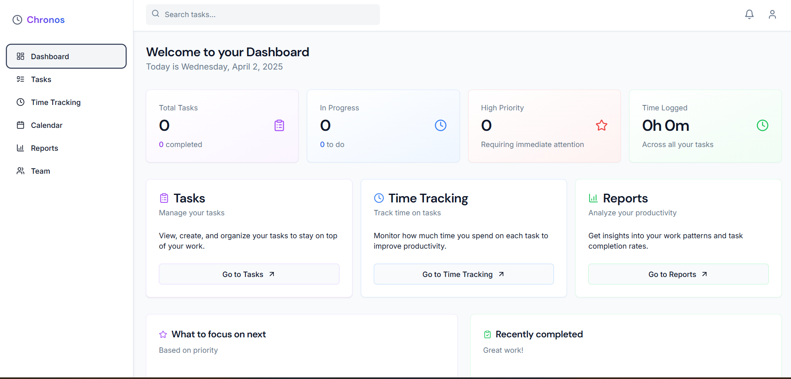

# 🚀 Chronos: Master Your Time, Conquer Your Tasks!

## 📌 Project Overview

Welcome to **Chronos**, a powerful full-stack task management system designed to take control of your time, streamline task delegation, and boost productivity for individuals and teams across all industries! Crafted with passion by **Badre Lahlou**, Chronos combines cutting-edge technology with an intuitive design to deliver seamless task tracking, role-based access, and insightful analytics. Whether you’re a corporate team juggling complex projects, a school managing student assignments, a freelancer tracking billable hours, or a healthcare team prioritizing patient care, Chronos has you covered.

🌟 **Why Chronos?** Inspired by the Greek word "chronos, Chronos empowers you to harness every second. Say goodbye to missed deadlines and chaotic workflows—Chronos brings order to your tasks with smart features like task dependencies, automated notifications, and customizable dashboards. It’s your ultimate companion for working smarter, not harder, no matter your field!

**Note**: This repository contains the full source code for Chronos, shared to showcase my skills to potential employers. While the code is publicly visible, Chronos is a proprietary project, and I kindly ask that it not be replicated or used without permission. I’m excited to deploy it as a live app soon—stay tuned!

---

## 🚀 Tech Stack: The Magic Behind the Scenes

### 🔹 Backend
- **Java (Spring Boot 3.4.3)**: The backbone of our scalable REST API, ensuring fast and reliable performance.
- **Spring Security**: Secures the app with JWT authentication and optional 2FA for enhanced protection.
- **Spring Data JPA**: Manages data persistence with PostgreSQL, handling complex relationships efficiently.
- **Spring Quartz**: Automates recurring tasks, making repetitive workflows a breeze.
- **Spring AMQP (RabbitMQ)**: Powers asynchronous notifications to keep users updated without delay.
- **Spring Cache (Caffeine)**: Enables offline access with smart caching—work anywhere, anytime!
- **Springdoc OpenAPI**: Provides API documentation for easy exploration.
- **Google Calendar API**: Syncs tasks with Google Calendar for seamless scheduling.

### 🔹 Frontend
- **React.js**: Delivers a sleek, dynamic interface that’s a joy to use.
- **Vite**: Speeds up development with lightning-fast builds.
- **Tailwind CSS**: Brings modern, responsive styling to every screen size.
- **TypeScript**: Ensures type-safe code, reducing bugs and improving maintainability.

### 🔹 Database
- **PostgreSQL**: Stores your data with optimized queries for tasks, users, and teams.

---

## 🎯 Key Features: What Makes Chronos Shine

- **Role-Based Access Control**: From Admins to Team Members, everyone gets the right level of access.
- **Task Management**: Assign tasks, set deadlines, and track progress with ease.
- **Time Tracking**: Log your hours directly in the frontend, with a user-friendly timer interface to monitor time spent on tasks.
- **Advanced Dashboards**: Get a bird’s-eye view of your tasks with customizable, data-driven metrics.
- **Secure Authentication**: Log in safely with JWT and optional 2FA via Google Authenticator.
- **Task Dependencies**: Keep projects on track with smart dependency management and delay alerts.
- **Collaboration Tools**: Add comments and file attachments to tasks for seamless team synergy.
- **Recurring Tasks**: Automate repetitive tasks with Quartz scheduling—set it and forget it!
- **Notifications**: Stay updated with automated alerts for deadlines and task updates, stored in the database and queued via RabbitMQ for asynchronous delivery.
- **Offline Access**: Cache tasks locally and sync when you’re back online.
- **External Integrations**: Sync tasks with Google Calendar to never miss a beat.
- **Audit Trail**: Keep track of user actions for transparency and accountability.
- **Feedback System**: Collect performance feedback to keep improving.
- **Resource Management**: Assign and monitor resources for every task.
- **Mobile Optimization**: Enjoy a responsive, touch-friendly interface optimized for mobile devices with Tailwind CSS.

---

## 🌟 Role Structure: Who Can Use Chronos?

### For Companies
- **Admin**: The mastermind who manages users, permissions, security (like 2FA), and system templates.
- **Project Manager**: Oversees projects, assigns tasks with dependencies, and dives into progress reports.
- **Team Leader**: Assigns team tasks, sets reminders, and keeps everyone on track.
- **Team Member**: Tackles tasks, logs time, and stays on top of deadlines with notifications.
- **External Viewer (Investor)**: Gets a read-only peek at project progress.

### For Educational Institutions
- **Principal**: Assigns department tasks and tracks student progress at a glance.
- **Teacher**: Manages student assignments and monitors academic performance.
- **Student**: Organizes study tasks and shares progress (read-only).

### For Individuals
- **Freelancer**: Tracks billable hours and creates client-ready reports.
- **Student**: Manages academic tasks and boosts productivity with ease.

### Additional Use Cases
- **Healthcare**: Doctors and nurses prioritize patient care tasks with precision.
- **Non-Profits**: Coordinators manage volunteer activities and campaigns effortlessly.
- **Legal Firms**: Lawyers track case deadlines and billable hours like pros.

*(Check out the full documentation for even more use cases!)*

---

## 🔍 Technical Highlights: Under the Hood

### Backend Overview
The backend of Chronos is a robust Spring Boot application, structured to handle complex task management workflows with ease. You can explore the full backend code in the [BackEnd/](BackEnd/) directory. Key components include:

- **Controllers**: Manage API endpoints for authentication, user management, task operations, and reporting. For example, the `TaskController` handles task creation, updates, and retrieval, while the `AuthController` secures user login with JWT.
- **Services**: Contain the business logic, such as the `NotificationService`, which creates and queues notifications using RabbitMQ for asynchronous delivery, ensuring users receive timely updates without overloading the server.
- **Repositories**: Provide data access using Spring Data JPA, with repositories like `TaskRepository` and `UserRepository` handling database operations for tasks, users, and more.
- **Models**: Define the data structure, such as the `Notification` entity, which stores notification details (e.g., message, user, timestamp) in PostgreSQL.

### Frontend Overview
The frontend of Chronos is a modern React application built with TypeScript and styled with Tailwind CSS, ensuring a responsive and user-friendly experience. You can explore the full frontend code in the [FrontEnd/](FrontEnd/) directory. Key aspects include:

- **Components**: Modular React components like task cards, user dashboards, and forms, designed to display and manage tasks efficiently. These components are styled with Tailwind CSS for a clean, responsive look across devices, using responsive classes (e.g., `sm:`, `md:`, `lg:`) to adapt layouts for mobile and desktop screens.
- **Time Tracking**: A dedicated time tracking feature allows users to start, stop, and log time spent on tasks. This is implemented with a timer component that tracks elapsed time and displays it in the UI, providing a seamless way to monitor productivity.
- **Mobile Optimization**: The app is fully optimized for mobile devices, with touch-friendly interactions (e.g., tap to edit tasks) and responsive layouts that adjust to different screen sizes, ensuring a smooth experience on both desktop and mobile.
- **Services**: API integration with the backend using `fetch` or a library like Axios, enabling the frontend to retrieve and update tasks, notifications, and user data via RESTful endpoints.

### Notification System
- Notifications are created, stored in the database, and queued using RabbitMQ for asynchronous processing.
- Users can fetch their notifications via API, with plans to add WebSocket support for real-time delivery.

### Planned Features
- **Real-Time Updates**: WebSocket integration for instant task notifications and updates—stay in the loop as it happens!
- **Gantt Charts**: Visualize task dependencies with stunning timelines.
- **Backend Time Tracking Persistence**: Add backend support to store time tracking data persistently in the database (currently implemented in the frontend).
- **Unit Testing**: Robust unit and integration tests with Spring Boot Test to ensure Chronos runs smoothly.
- **Docker Support**: Containerized deployment for seamless scalability and consistency.

---

## 📊 Database Schema Overview

- **Users**: Stores user details (ID, name, email, role) with encrypted passwords.
- **Tasks**: Tracks task metadata (title, description, status, assigned user, deadline, dependencies).
- **Teams**: Defines team structures with leader assignments.
- **AuditTrail**: Logs user actions for accountability.
- **Feedback**: Stores performance feedback for users.
- **Notifications**: Manages automated alerts for users (ID, user, message, createdAt, isRead).
- **TaskComments**: Enables team collaboration with comments.
- **TaskAttachments**: Supports file uploads for tasks.
- **Resources**: Tracks resources assigned to tasks.

---

## 🎨 Visual Showcase: See Chronos in Action

### Frontend Interface
Here’s a glimpse of the Chronos frontend, where users can manage tasks, track time, and collaborate with their team. The UI is built with React and Tailwind CSS for a modern, responsive experience across devices.

---

## 🤝 Deployment Plans

Chronos is gearing up to go live as a fully functional app! Soon, you’ll be able to access it via a secure URL, complete with user registration and login features. The deployment will feature:
- **Docker**: For consistent, containerized environments that scale effortlessly.
- **Cloud Hosting**: Ensuring Chronos is always up and running, no matter the load.
- **HTTPS**: Keeping your data secure with encrypted communication.

Keep an eye out for the launch—I can’t wait to share it with you!

---

## 📜 License & Usage

Chronos is a personal project by **Badre Lahlou**, and I’m thrilled to share its features and code with you to showcase my skills! The full source code is available in this repository for potential employers to review. However, as I’m working on deploying Chronos as a live app, I kindly ask that the code not be replicated or used without permission. I’d love for you to try out the deployed version once it’s ready and let me know what you think. Thanks for your support!

---

## ✨ Acknowledgments

- A huge shoutout to the open-source community for amazing tools like Spring Boot, React, and PostgreSQL.
- Inspired by the mission to bring order to chaotic workflows and make time management a breeze.

---

## 🚀 About the Author

Developed by **Badre Lahlou**, a passionate software engineer dedicated to building scalable, user-centric solutions. Chronos is a labor of love, born from the desire to help people master their time and achieve their goals with ease.
